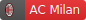
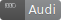
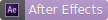
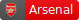
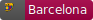
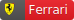
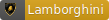

#  Web Badges :blush: 

 

👋 Sample Badges -      

 

## 📝 About

:hearts: **These badges are created by me using the svg image coding, these badges can be used by anyone and where they want on the web using the link(url) of the respective badge. You can use these badges in any documentations you want, on github, in your website and lots of other web stuffs where you need these badges** :hearts:

 

## 📛 List of Badges

### Football(Soccer) Clubs ⚽

-  A badge used for representing Ac Milan Football Club Lovers
-  A badge used for representing Arsenal Football Club Lovers
-  A badge used for representing Barcelona Football Club Lovers
-  A badge used for representing Bayern Munchen Football Club Lovers
-  A badge used for representing Chelsea Football Club Lovers
-  A badge used for representing Liverpool Football Club Lovers
-  A badge used for representing Manchester United Football Club Lovers
-  A badge used for representing Real Madrid Football Club Lovers

 

### Cars 🚗

-  A badge used for representing Audi
-  A badge used for representing BMW
-  A badge used for representing Bugatti
-  A badge used for representing Ferrari
-  A badge used for representing Lamborghini
-  A badge used for representing Land Rover
-  A badge used for representing Maserati
-  A badge used for Mercedes benz
