#  Web Badges 😊 

**View project on** [](https://github.com/arnoldvaz27/arnoldvaz27.github.io)

<br>

👋 Sample Badges -   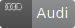   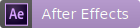

<br>

***Alternate Web Badges : -*** [Round Corner Web Badges](https://github.com/arnoldvaz27/arnoldvaz27.github.io)

## 📝 About

❤️ **These badges are created by me using the svg image coding, these badges can be used by anyone and where they want on the web using the link(url) of the respective badge. You can use these badges in any documentations you want, on github, in your website and lots of other web stuffs where you need these badges** ❤️

<br>

## 📛 List of Badges ```Flat Corner```

### Microsoft Products 🏢 

- [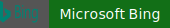](https://arnoldvaz27.github.io/webbadges/microsoft/bing_flat_square.svg) A badge used for representing Bing
- [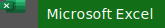](https://arnoldvaz27.github.io/webbadges/microsoft/excel_flat_square.svg) A badge used for representing Excel
- [](https://arnoldvaz27.github.io/webbadges/microsoft/onedrive_flat_square.svg) A badge used for representing One Drive
- [](https://arnoldvaz27.github.io/webbadges/microsoft/outlook_flat_square.svg) A badge used for representing Outlook
- [](https://arnoldvaz27.github.io/webbadges/microsoft/powerpoint_flat_square.svg) A badge used for representing Powepoint
- [](https://arnoldvaz27.github.io/webbadges/microsoft/skype_flat_square.svg) A badge used for representing Skype
- [](https://arnoldvaz27.github.io/webbadges/microsoft/word_flat_square.svg) A badge used for representing Word
<br>

### Code-spaces / Editors / Coding Community 📄

- [](https://arnoldvaz27.github.io/webbadges/codespaces/atom_flat_square.svg) A badge used for representing Atom Editor
- [](https://arnoldvaz27.github.io/webbadges/codespaces/codepen_flat_square.svg) A badge used for representing Codepen Editor
- [](https://arnoldvaz27.github.io/webbadges/codespaces/dreamweaver_flat_square.svg) A badge used for representing Dreamweaver Editor
- [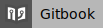](https://arnoldvaz27.github.io/webbadges/codespaces/gitbook_1_flat_square.svg) A badge used for representing Gitbook 1 
- [](https://arnoldvaz27.github.io/webbadges/codespaces/gitbook_2_flat_square.svg) A badge used for representing Gitbook 2
- [](https://arnoldvaz27.github.io/webbadges/codespaces/github_flat_square.svg) A badge used for representing Github
- [](https://arnoldvaz27.github.io/webbadges/codespaces/gitlab_flat_square.svg) A badge used for representing Gitlab
- [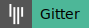](https://arnoldvaz27.github.io/webbadges/codespaces/gitter_flat_square.svg) A badge used for Gitter
- [](https://arnoldvaz27.github.io/webbadges/codespaces/idea_flat_square.svg) A badge used for Idea
- [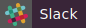](https://arnoldvaz27.github.io/webbadges/codespaces/slack_flat_square.svg) A badge used for Slack
- [](https://arnoldvaz27.github.io/webbadges/codespaces/stackexchange_flat_square.svg) A badge used for Stack Exchange
- [](https://arnoldvaz27.github.io/webbadges/codespaces/stackoverflow_flat_square.svg) A badge used for Sack Overflow
- [](https://arnoldvaz27.github.io/webbadges/codespaces/sublime_text_flat_square.svg) A badge used for Sublime Text
- [](https://arnoldvaz27.github.io/webbadges/codespaces/visual_studio_flat_square.svg) A badge used for Visual Studio
- [](https://arnoldvaz27.github.io/webbadges/codespaces/visual_studio_code_flat_square.svg) A badge used for Visual Studio Code


<br>

### Programming Languages / Softwares 📟 

- [](https://arnoldvaz27.github.io/webbadges/programming/angular_flat_square.svg) A badge used for representing Angular coding
- [](https://arnoldvaz27.github.io/webbadges/programming/docker_flat_square.svg) A badge used for representing Docker coding
- [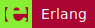](https://arnoldvaz27.github.io/webbadges/programming/erlang_flat_square.svg) A badge used for representing Erlang coding
- [](https://arnoldvaz27.github.io/webbadges/programming/golang_flat_square.svg) A badge used for representing Golang coding
- [](https://arnoldvaz27.github.io/webbadges/programming/java_flat_square.svg) A badge used for representing Java coding
- [](https://arnoldvaz27.github.io/webbadges/programming/javascript_flat_square.svg) A badge used for representing Javascript coding
- [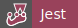](https://arnoldvaz27.github.io/webbadges/programming/jest_1_flat_square.svg) A badge used for representing Jest_1 (1st format)
- [](https://arnoldvaz27.github.io/webbadges/programming/jest_2_flat_square.svg) A badge used for representing Jest_2 (2nd format)
- [](https://arnoldvaz27.github.io/webbadges/programming/kotlin_flat_square.svg) A badge used for representing Kotlin coding
- [](https://arnoldvaz27.github.io/webbadges/programming/node_flat_square.svg) A badge used for representing Node coding
- [](https://arnoldvaz27.github.io/webbadges/programming/npm_flat_square.svg) A badge used for representing Npm
- [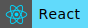](https://arnoldvaz27.github.io/webbadges/programming/react_flat_square.svg) A badge used for representing React coding
- [](https://arnoldvaz27.github.io/webbadges/programming/reactivex_flat_square.svg) A badge used for Representing reactivex coding
- [](https://arnoldvaz27.github.io/webbadges/programming/redux_flat_square.svg) A badge used for representing Redux coding
- [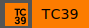](https://arnoldvaz27.github.io/webbadges/programming/tc39_flat_square.svg) A badge used for representing Tc39
- [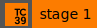](https://arnoldvaz27.github.io/webbadges/programming/tc39_2_flat_square.svg) A badge used for representing Tc39_1 
- [](https://arnoldvaz27.github.io/webbadges/programming/tc39_4_flat_square.svg) A badge used for representing Tc39_3 
- [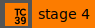](https://arnoldvaz27.github.io/webbadges/programming/tc39_5_flat_square.svg) A badge used for representing Tc39_4 
- [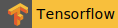](https://arnoldvaz27.github.io/webbadges/programming/tensorflow_flat_square.svg) A badge used for representing Tensorflow coding
- [](https://arnoldvaz27.github.io/webbadges/programming/typescript_flat_square.svg) A badge used for representing Typescript coding
- [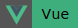](https://arnoldvaz27.github.io/webbadges/programming/vue_flat_square.svg) A badge used for representing Vue coding
- [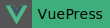](https://arnoldvaz27.github.io/webbadges/programming/vuepress_flat_square.svg) A badge used for representing Vuepress coding
- [](https://arnoldvaz27.github.io/webbadges/programming/webpack_flat_square.svg) A badge used for representing Webpack 

<br>

### Designer / Creative / Software Tools 📊 

- [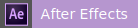](https://arnoldvaz27.github.io/webbadges/designer/after_effects_flat_square.svg) A badge used for representing adobe after effects
- [](https://arnoldvaz27.github.io/webbadges/designer/behance_flat_square.svg) A badge used for representing behance tool
- [](https://arnoldvaz27.github.io/webbadges/designer/flash_flat_square.svg) A badge used for representing flash tool
- [](https://arnoldvaz27.github.io/webbadges/designer/illustrator_flat_square.svg) A badge used for representing adobe illustrator
- [](https://arnoldvaz27.github.io/webbadges/designer/photoshop_flat_square.svg) A badge used for representing adobe photoshop
- [](https://arnoldvaz27.github.io/webbadges/designer/premiere_flat_square.svg) A badge used for representing adobe premiere
- [](https://arnoldvaz27.github.io/webbadges/designer/zeplin_flat_square.svg) A badge used for representing zeplin

<br>

### Developement Tools ✨

- [](https://arnoldvaz27.github.io/webbadges/development/apiary_flat_square.svg) A badge used for representing Apiary
- [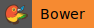](https://arnoldvaz27.github.io/webbadges/development/bower_flat_square.svg) A badge used for representing Bower
- [](https://arnoldvaz27.github.io/webbadges/development/codrops_flat_square.svg) A badge used for representing Codrops
- [](https://arnoldvaz27.github.io/webbadges/development/coremail_flat_square.svg) A badge used for representing Coremail
- [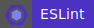](https://arnoldvaz27.github.io/webbadges/development/eslint_flat_square.svg) A badge used for representing Eslint
- [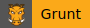](https://arnoldvaz27.github.io/webbadges/development/grunt_flat_square.svg) A badge used for representing Grunt
- [](https://arnoldvaz27.github.io/webbadges/development/gulp_flat_square.svg) A badge used for representing Gulp
- [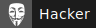](https://arnoldvaz27.github.io/webbadges/development/hacker_flat_square.svg) A badge used for representing Hacker
- [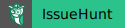](https://arnoldvaz27.github.io/webbadges/development/issuehunt_flat_square.svg) A badge used for representing Issuehunt
- [](https://arnoldvaz27.github.io/webbadges/development/jasmine_flat_square.svg) A badge used for representing Jasmine
- [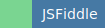](https://arnoldvaz27.github.io/webbadges/development/jsfiddle_flat_square.svg) A badge used for representing Js Fiddle
- [](https://arnoldvaz27.github.io/webbadges/development/juejin_translation_flat_square.svg) A badge used for representing Juejin Translation
- [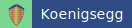](https://arnoldvaz27.github.io/webbadges/development/koenigsegg._flat_squaresvg) A badge used for representing Koenigsegg
- [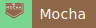](https://arnoldvaz27.github.io/webbadges/development/mocha_flat_square.svg) A badge used for representing mocha
- [](https://arnoldvaz27.github.io/webbadges/development/modernizr_flat_square.svg) A badge used for representing Modernizr
- [](https://arnoldvaz27.github.io/webbadges/development/monsoon_flat_square.svg) A badge used for representing Monsoon
- [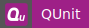](https://arnoldvaz27.github.io/webbadges/development/qunit_flat_square.svg) A badge used for representing qunit
- [](https://arnoldvaz27.github.io/webbadges/development/rollup_flat_square.svg) A badge used for representing Rollup
- [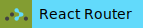](https://arnoldvaz27.github.io/webbadges/development/router_flat_square.svg) A badge used for representing Router
- [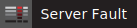](https://arnoldvaz27.github.io/webbadges/development/serverfault_flat_square.svg) A badge used for representing Serverfault
- [](https://arnoldvaz27.github.io/webbadges/development/superuser_flat_square.svg) A badge used for representing Superuser

<br>

### Football(Soccer) Clubs ⚽

- [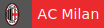](https://arnoldvaz27.github.io/webbadges/footballclubs/ac_milan_flat_square.svg) A badge used for representing Ac Milan Football Club Lovers
- [](https://arnoldvaz27.github.io/webbadges/footballclubs/arsenal_flat_square.svg) A badge used for representing Arsenal Football Club Lovers
- [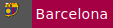](https://arnoldvaz27.github.io/webbadges/footballclubs/barcelona_flat_square.svg) A badge used for representing Barcelona Football Club Lovers
- [](https://arnoldvaz27.github.io/webbadges/footballclubs/bayern_munchen_flat_square.svg) A badge used for representing Bayern Munchen Football Club Lovers
- [](https://arnoldvaz27.github.io/webbadges/footballclubs/chelsea_flat_square.svg) A badge used for representing Chelsea Football Club Lovers
- [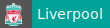](https://arnoldvaz27.github.io/webbadges/footballclubs/liverpool_flat_square.svg) A badge used for representing Liverpool Football Club Lovers
- [](https://arnoldvaz27.github.io/webbadges/footballclubs/manchester_united_flat_square.svg) A badge used for representing Manchester United Football Club Lovers
- [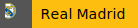](https://arnoldvaz27.github.io/webbadges/footballclubs/real_madrid_flat_square.svg) A badge used for representing Real Madrid Football Club Lovers

<br>

### Cars 🚗

- [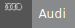](https://arnoldvaz27.github.io/webbadges/cars/audi_flat_square.svg) A badge used for representing Audi
- [](https://arnoldvaz27.github.io/webbadges/cars/bmw_flat_square.svg) A badge used for representing BMW
- [](https://arnoldvaz27.github.io/webbadges/cars/bugatti_flat_square.svg) A badge used for representing Bugatti
- [](https://arnoldvaz27.github.io/webbadges/cars/ferrari_flat_square.svg) A badge used for representing Ferrari
- [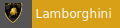](https://arnoldvaz27.github.io/webbadges/cars/lamborghini_flat_square.svg) A badge used for representing Lamborghini
- [](https://arnoldvaz27.github.io/webbadges/cars/land_rover_flat_square.svg) A badge used for representing Land Rover
- [](https://arnoldvaz27.github.io/webbadges/cars/maserati_flat_square.svg) A badge used for representing Maserati
- [](https://arnoldvaz27.github.io/webbadges/cars/mercedes_benz_flat_square.svg) A badge used for Mercedes benz

<br>

### Companies 🏬

- [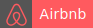](https://arnoldvaz27.github.io/webbadges/companies/airbnb_flat_square.svg) A badge used for representing Airbnb
- [](https://arnoldvaz27.github.io/webbadges/companies/amazon_flat_square.svg) A badge used for representing Amazon
- [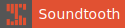](https://arnoldvaz27.github.io/webbadges/companies/soundtooth_flat_square.svg) A badge used for representing Sound tooth
- [](https://arnoldvaz27.github.io/webbadges/companies/xitu_flat_square.svg) A badge used for representing Xitu

<br>

### Game Stations 💻 

- [](https://arnoldvaz27.github.io/webbadges/gamestations/ingress_flat_square.svg) A badge used for representing games on ingress
- [](https://arnoldvaz27.github.io/webbadges/gamestations/osu_flat_square.svg) A badge used for representing games on osu
- [](https://arnoldvaz27.github.io/webbadges/gamestations/steam._flat_squaresvg) A badge used for representing games on steam

<br>

### Finance / Sponsors 💰

- [](https://arnoldvaz27.github.io/webbadges/finance/alipay_flat_square.svg) A badge used for representing alipay payments
- [](https://arnoldvaz27.github.io/webbadges/finance/bitcoin_flat_square.svg) A badge used for representing bitcoin transaction
- [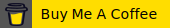](https://arnoldvaz27.github.io/webbadges/finance/buymeacoffee_flat_square.svg) A badge used for representing buy me coffee website payment
- [](https://arnoldvaz27.github.io/webbadges/finance/patreon_flat_square.svg) A badge used for representing patreon website payment
- [](https://arnoldvaz27.github.io/webbadges/finance/paypal_flat_square.svg) A badge used for representing paypal website payment

<br>

### Social Media ✨

- [](https://arnoldvaz27.github.io/webbadges/socialmedia/facebook_flat_square.svg) A badge used for representing Facebook
- [](https://arnoldvaz27.github.io/webbadges/socialmedia/google_plus_flat_square.svg) A badge used for representing Google Plus
- [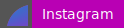](https://arnoldvaz27.github.io/webbadges/socialmedia/instagram_flat_square.svg) A badge used for representing Instagram
- [](https://arnoldvaz27.github.io/webbadges/socialmedia/line_flat_square.svg) A badge used for representing Line
- [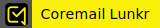](https://arnoldvaz27.github.io/webbadges/socialmedia/lunkr_flat_square.svg) A badge used for representing Lunkr
- [](https://arnoldvaz27.github.io/webbadges/socialmedia/medium_flat_square.svg) A badge used for representing Medium
- [](https://arnoldvaz27.github.io/webbadges/socialmedia/messenger_flat_square.svg) A badge used for Representing messenger
- [](https://arnoldvaz27.github.io/webbadges/socialmedia/pinterest_flat_square.svg) A badge used for Representing pinterest
- [](https://arnoldvaz27.github.io/webbadges/socialmedia/reddit_flat_square.svg) A badge used for representing Reddit
- [](https://arnoldvaz27.github.io/webbadges/socialmedia/rss_flat_square.svg) A badge used for representing rss
- [](https://arnoldvaz27.github.io/webbadges/socialmedia/sina_weibo_flat_square.svg) A badge used for representing Sina Weibo
- [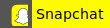](https://arnoldvaz27.github.io/webbadges/socialmedia/snapchat_flat_square.svg) A badge used for representing Snapchat
- [](https://arnoldvaz27.github.io/webbadges/socialmedia/soundcloud_flat_square.svg) A badge used for representing Soundcloud
- [](https://arnoldvaz27.github.io/webbadges/socialmedia/spotify_flat_square.svg) A badge used for representing Spotify
- [](https://arnoldvaz27.github.io/webbadges/socialmedia/telegram_flat_square.svg) A badge used for representing Telegram
- [](https://arnoldvaz27.github.io/webbadges/socialmedia/skype_flat_square.svg) A badge used for representing skype
- [](https://arnoldvaz27.github.io/webbadges/socialmedia/wechat_flat_square.svg) A badge used for representing Wechat
- [](https://arnoldvaz27.github.io/webbadges/socialmedia/whatsapp_flat_square.svg) A badge used for representing Whatsapp
- [](https://arnoldvaz27.github.io/webbadges/socialmedia/youtube_flat_square.svg) A badge used for representing Youtube


<br>

### Industries / Factories 🏬

- [](https://arnoldvaz27.github.io/webbadges/inc/reliance_flat_square.svg) A badge used for representing person working in Reliance Industries
- [](https://arnoldvaz27.github.io/webbadges/inc/serum_flat_square.svg) A badge used for representing person working in Serum Institute

<br>

### Tele Communication Companies 📱

- [](https://arnoldvaz27.github.io/webbadges/telecomcompanies/airtel_flat_square.svg) A badge used for representing people or project related to Airtel
- [](https://arnoldvaz27.github.io/webbadges/telecomcompanies/jio_flat_square.svg) A badge used for representing people or project related to Jio

<br>

### Space Organizations 🚀

- [](https://arnoldvaz27.github.io/webbadges/spaceorganizations/nasa_flat_square.svg) A badge used for representing people or project related to Nasa

<br>

**More Badges coming soon** 

Follow this project on [](https://github.com/arnoldvaz27/arnoldvaz27.github.io)


## Developed By

### Made with ♥ by Arnold Vaz
